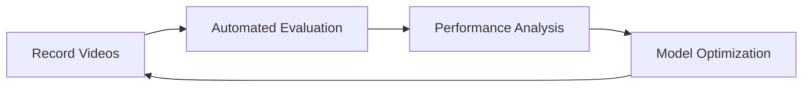

# 🍳 Viam Cooking Action Analysis

> **Automated recording, classification, and evaluation of cooking actions using Viam robotics platform**

This repository provides a complete pipeline for recording cooking videos and evaluating action classification performance using computer vision and AI.

## 📁 Repository Structure

```
recordScript/
├── 📹 recording/          # Video recording tools
│   ├── record_rgb_interactive.py  # Interactive cooking coaching
│   ├── record_rgb.py              # Basic video recording
│   ├── record.py                   # Recording launcher
│   ├── test_connection.py          # Connection testing
│   ├── setup_environment.sh        # Environment setup
│   └── output/                    # Video and CSV output files
├── 🔍 evaluation/         # Automated evaluation pipeline
│   ├── automate_evaluation.py     # Main evaluation automation
│   ├── setup_automation.py        # Evaluation environment setup
│   ├── extract_and_align_classifier.py  # Core analysis engine
│   ├── time_alignment_analyzer.py # Temporal analysis tools
│   └── evaluation_results/        # Evaluation outputs
├── 📊 data/              # Datasets, samples, and results
├── 📚 docs/              # Detailed documentation
├── README.md             # This file
└── requirements.txt      # Python dependencies
```

## 🚀 Quick Start

### **Option 1: Just Want to Evaluate? (Most Common)**

```bash
# 1. Setup evaluation environment
cd evaluation/
python3 setup_automation.py

# 2. Configure your video in Viam dashboard
# (Set the video path in replayCamera-1 component)

# 3. Run automated evaluation
python3 automate_evaluation.py

# 4. Review results in evaluation_results/ directory! ☕
```

### **Option 2: Want to Record New Videos?**

```bash
# 1. Setup recording environment
cd recording/
./setup_environment.sh

# 2. Test your Viam connection
python3 test_connection.py

# 3. Start interactive recording session
VIAM_CAMERA_NAME="overhead-rgb" python3 record_rgb_interactive.py
```

## 🎯 Main Features

### 🤖 **Simplified Automated Evaluation**

-   **Manual video setup** - configure video path in Viam dashboard
-   **Smart video detection** - knows when videos finish playing
-   **Automatic log capture** - captures and monitors server logs
-   **Comprehensive analysis** - detailed performance metrics and insights
-   **Single session focus** - process one video at a time for better control

### 📹 **Interactive Recording**

-   **Guided cooking sessions** - step-by-step action prompts
-   **Separate video files** - individual recordings per action type
-   **Automatic logging** - CSV timelines and action metadata
-   **Real-time coaching** - cooking guidance and feedback

### 📊 **Advanced Analytics**

-   **Action classification** - detects cooking actions with confidence scores
-   **Performance evaluation** - compares against ground truth datasets
-   **Motion analysis** - similarity scoring and temporal analysis
-   **Actionable insights** - optimization recommendations

## 📚 Detailed Documentation

| Section           | Purpose                       | Link                                                    |
| ----------------- | ----------------------------- | ------------------------------------------------------- |
| **🔍 Evaluation** | Automated evaluation pipeline | [📖 evaluation/README.md](docs/README_evaluation.md.md) |
| **📹 Recording**  | Video recording tools         | [📖 recording/README.md](docs/README_recording.md)      |
| **📊 Data**       | Datasets and sample files     | [📖 data/README.md](data/)                              |

## 🔄 Typical Workflow



### **For Researchers/Developers:**

1. **Record** cooking actions using interactive tools
2. **Evaluate** classifier performance automatically
3. **Analyze** results and identify improvement areas
4. **Optimize** model parameters and retrain
5. **Repeat** for continuous improvement

### **For Quick Evaluation:**

1. **Configure** your video in Viam dashboard (replayCamera-1 component)
2. **Run** automated evaluation pipeline
3. **Review** detailed performance report
4. **Switch video** in dashboard and repeat for next video

## 🛠️ Technical Requirements

### **Core Dependencies**

-   **Python 3.7+** with pip
-   **Viam SDK** (`pip install viam-sdk`)
-   **OpenCV** for video processing
-   **viam-server** installed and in PATH

### **Viam Configuration**

-   Valid Viam robot with camera component
-   Cloud-managed machine configuration
-   `replayCamera-1` component for video replay
-   Action classifier modules installed

### **Quick Setup**

```bash
# 1. Create and activate virtual environment
python3 -m venv venv
source venv/bin/activate  # On Windows: venv\Scripts\activate

# 2. Upgrade pip and install dependencies
pip install --upgrade pip
pip install -r requirements.txt

# 3. Validate setup (evaluation)
cd evaluation && python3 setup_automation.py

# Or validate setup (recording)
cd recording && ./setup_environment.sh
```

**Alternative: Use the automated setup script**

```bash
# Run the setup script (includes all steps above)
./setup_environment.sh
```

## 📈 What You Get

### **Automated Evaluation Results:**

-   ✅ **Session analysis** with detailed metrics
-   ✅ **Action detection timeline** with confidence scores
-   ✅ **Performance insights** for optimization
-   ✅ **Timeline exports** for debugging and review
-   ✅ **JSON reports** for integration with other tools

### **Recording Outputs:**

-   ✅ **High-quality video files** for each action type
-   ✅ **Detailed action logs** with timestamps
-   ✅ **Metadata exports** for training and evaluation

## 🎯 Use Cases

### **🔬 Research & Development**

-   Evaluate action classification models
-   Generate training datasets
-   Analyze model performance across different scenarios
-   Optimize confidence thresholds and parameters

### **🏭 Production Monitoring**

-   Continuous evaluation of deployed models
-   Performance tracking over time
-   Automated quality assurance
-   Integration with CI/CD pipelines

### **📚 Education & Training**

-   Learn computer vision and robotics
-   Understand action recognition pipelines
-   Hands-on experience with Viam platform
-   Real-world AI/ML applications

## 🚨 Troubleshooting

**Common Issues:**

| Problem                 | Solution                                     |
| ----------------------- | -------------------------------------------- |
| `viam-server not found` | Install viam-server and add to PATH          |
| `Machine ID not found`  | Check Viam config file has valid credentials |
| `Config update failed`  | Verify Viam API access and permissions       |
| `Analysis failed`       | Ensure scripts are in correct directories    |

**Need Help?**

-   Check the detailed documentation in [`docs/`](docs/)
-   Run setup scripts to validate your environment
-   Review error logs in the output directories

## 🔄 Migration Guide

**Upgrading from manual evaluation?**

**Before (Manual Process):**

```bash
# 😴 Tedious manual steps for each video:
# 1. Edit config file manually
# 2. Run viam-server
# 3. Wait and copy logs
# 4. Run analysis manually
# 5. Repeat...
```

**After (Streamlined):**

```bash
# 🚀 Simple workflow:
# 1. Configure video in Viam dashboard once
# 2. Run automation script
cd evaluation/
python3 automate_evaluation.py
# 3. Review results - done!
```

## 🤝 Contributing

This is an active research project! Contributions welcome:

1. **Fork** the repository
2. **Create** a feature branch
3. **Test** thoroughly with your setup
4. **Submit** a pull request

## 📄 License

[Add your license information here]

---

> **💡 Pro Tip:** Start with the automated evaluation if you just want to analyze existing videos. Use the recording tools if you need to create new training data or test scenarios.

**🎯 Ready to get started?** Choose your path above and dive into the detailed documentation!
