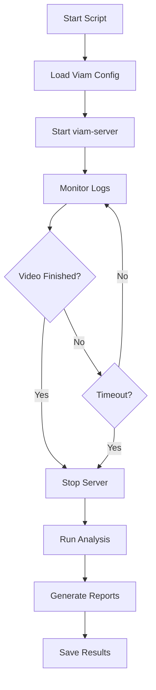

# 🔍 Evaluation Pipeline

> **Automated evaluation of cooking action classification performance**

This directory contains tools for automatically running Viam servers, capturing logs, and analyzing action classification performance.

## 🚀 Quick Start

### **Prerequisites**

-   ✅ **viam-server** installed and in PATH
-   ✅ **Valid Viam configuration** file with credentials
-   ✅ **replayCamera-1 component** configured in your Viam machine
-   ✅ **Video file** path set in the Viam dashboard

### **Basic Usage**

```bash
# Navigate to evaluation directory
cd evaluation/

# Run with default settings (recommended)
python automate_evaluation.py

# Or with custom options
python automate_evaluation.py \
    --config /path/to/viam-config.json \
    --output-dir my_results \
    --timeout 15
```

## 📋 Step-by-Step Process

### **Step 1: Configure Video in Viam Dashboard**

1. Go to your **Viam machine configuration**
2. Find the **`replayCamera-1`** component
3. Update the **`video_path`** attribute to your target video file:
    ```json
    {
    	"name": "replayCamera-1",
    	"api": "rdk:component:camera",
    	"model": "bill:camera:video-replay",
    	"attributes": {
    		"mode": "local",
    		"fps": 2,
    		"loop_video": false,
    		"video_path": "/full/path/to/your/video.mp4"
    	}
    }
    ```
4. **Save** the configuration

### **Step 2: Run Automation Script**

```bash
python automate_evaluation.py
```

The script will:

1. **🚀 Start viam-server** using your configuration
2. **📺 Monitor logs** for end-of-file signal
3. **🎬 Detect completion** when video finishes
4. **🔍 Run analysis** using `extract_and_align_classifier.py`
5. **📊 Generate reports** and save results

### **Step 3: Review Results**

Results are saved in `evaluation_results/` directory:

```
evaluation_results/
├── viam_server_20240612_143022.log           # Raw server logs
├── viam_server_20240612_143022.analysis.txt  # Processed analysis
├── viam_server_20240612_143022_timeline.log  # Classification timeline
└── evaluation_results_20240612_143022.json   # Complete results
```

## 🔧 Command Line Options

| Option         | Default                                                     | Description                     |
| -------------- | ----------------------------------------------------------- | ------------------------------- |
| `--config`     | `/Users/marcuslam/Desktop/Gambit/viam-marcus-dev-main.json` | Path to Viam configuration file |
| `--output-dir` | `evaluation_results`                                        | Output directory for results    |
| `--timeout`    | `10`                                                        | Timeout in minutes per session  |

## 📊 Understanding Results

### **Console Output**

```
🎯 Starting Simplified Evaluation Pipeline
============================================================
📁 Output directory: evaluation_results
⚙️  Viam config: /path/to/config.json
📋 Make sure your video is configured in the Viam dashboard

🚀 Starting viam-server
⏱️  Timeout: 10 minutes
📺 Monitoring logs for end-of-file signal...
📝 Logs being written to: evaluation_results/viam_server_20240612_143022.log

🎬 Video playback completed!
✅ Log capture complete: evaluation_results/viam_server_20240612_143022.log

🔍 Running analysis for: current_session
✅ Analysis completed successfully
📄 Analysis saved to: evaluation_results/viam_server_20240612_143022.analysis.txt
✅ Successfully processed session

📊 Generating Summary Report
============================================================
🎯 Total detections: 12
✅ Accepted: 8
❌ Rejected: 4
📈 Acceptance rate: 66.7%
🎯 Average confidence: 85.3%
📊 Average similarity: 78.2%
⚡ Average analysis time: 2.1s

🎉 Evaluation Pipeline Complete!
📊 Results saved to: evaluation_results
```

### **Analysis Files**

**`.analysis.txt`** - Human-readable analysis with:

-   Detection summaries
-   Action breakdowns
-   Performance metrics
-   Recommendations

**`_timeline.log`** - Detailed classification timeline with:

-   Raw log blocks for each detection
-   Motion detection details
-   Claude analysis responses
-   Acceptance/rejection decisions

**`.json`** - Machine-readable results for integration

## 🔄 Multiple Video Workflow

To evaluate multiple videos:

1. **Configure first video** in Viam dashboard
2. **Run automation script**
3. **Review results**
4. **Configure next video** in dashboard
5. **Repeat** - each run creates separate result files

## 🚨 Troubleshooting

### **Common Issues**

| Problem                 | Solution                                            |
| ----------------------- | --------------------------------------------------- |
| `viam-server not found` | Install viam-server and add to PATH                 |
| `Config file not found` | Check path with `--config` option                   |
| `Video doesn't start`   | Verify video path is correct in Viam dashboard      |
| `Analysis fails`        | Check that `extract_and_align_classifier.py` exists |
| `Timeout reached`       | Increase timeout with `--timeout` option            |

### **Debug Tips**

-   **Check server logs** - Look at the raw `.log` file for errors
-   **Verify video path** - Ensure the video file exists and is accessible
-   **Test viam-server manually** - Run `viam-server -config your-config.json`
-   **Check Viam dashboard** - Ensure your machine configuration is valid

## 🛠️ Script Details

### **Key Components**

-   **`automate_evaluation.py`** - Main automation script
-   **`extract_and_align_classifier.py`** - Log analysis and classification extraction
-   **`setup_automation.py`** - Environment validation (optional)

### **Process Flow**



## 🎯 Tips for Best Results

1. **Use consistent video format** - MP4 works best
2. **Set appropriate FPS** - 2 FPS is usually optimal
3. **Disable video looping** - Set `loop_video: false`
4. **Allow full completion** - Let videos play to end for accurate analysis
5. **Check logs regularly** - Monitor for any error patterns

---

> **💡 Pro Tip:** Keep a spreadsheet tracking which videos you've evaluated and their results for easy comparison across different videos or model versions!
